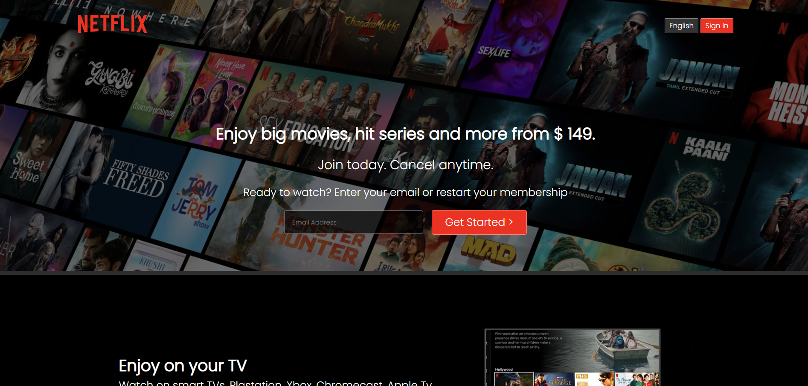

# 📺 Netflix Clone - Landing Page

This is a **responsive clone of Netflix India's landing page** created using **HTML5** and **CSS3**. It's designed to visually mimic the official website, including the hero section, feature highlights, FAQs, and footer — purely for educational and practice purposes.

---

## 🔍 Live Preview

[🔗 View Live](https://biswajit-pal1.github.io/Netflix-UI-Clone/)
    

---

## 🧰 Tech Stack

- ✅ HTML5  
- ✅ CSS3  
- ✅ Flexbox & Responsive Design  
- 🚫 No JavaScript (yet!)

---

## 📌 Features

- ✅ Hero section with CTA and email form  
- ✅ Background overlay for immersive experience  
- ✅ Informational sections with videos and images  
- ✅ Styled FAQ accordion layout  
- ✅ Responsive footer with multiple columns  
- ✅ Modern, Netflix-inspired design  

---

## 📷 Screenshot

